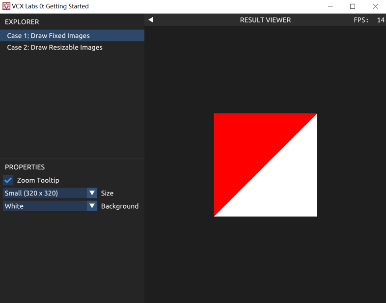
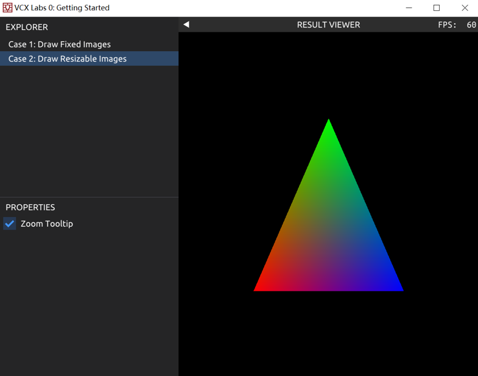

# 可视计算与交互概论 Tutorial for Lab 0

## 课程实践（Lab 和 Project） 简介

首先，欢迎大家修习这门课程。我们这学期共需要大家完成紧密围绕课程内容的 5 个 Lab，它们分别对应这门课程的五个核心主题：

 1. 2D 绘图与显示
 2. 几何处理
 3. 3D 渲染与全局光照
 4. 动画与仿真
 5. 可视化与交互

上述每个 Lab 都包含2-5个要求完成的 Task，以及一些供大家发挥的 Bonus Task。

除此之外，大家也会在学期末完成一项课程 Project。我们会提供一些 Project 题目供大家挑选，同时也很期待看到大家在课堂上找到自己在可视计算领域感兴趣的方向，并以此作为你的课程 Project。

本学期的 5 个 Lab 基于同一个代码库，因此在我们下发第一个 Lab 之前，我们需要确保你的计算机能够正常运行我们的 Lab 代码库，帮助你建立一个趁手的开发环境，并跑通整个开发流程。

我们的 Lab 支持 Windows, MacOS 和 Linux 的大多数发行版。如果你需要关于 Lab 的任何帮助，欢迎联系课程助教。

## Lab 0: Build the Codebase

### 1 - Merge Handout Packs

我们的 Lab 位于网址 [https://gitee.com/pku-vcl/vcx2024.git](https://gitee.com/pku-vcl/vcx2024.git) 。首先你需要按照 [Git 官网](https://git-scm.com/) 的指引安装 Git 。安装好 Git 之后，使用 Git 将 Lab 仓库 clone 到你喜欢的目录下，这将建立一个名为 `vcx` 的目录：这就是你这个学期做所有 Lab 的目录。

```shell
git clone https://gitee.com/pku-vcl/vcx2024.git
```

你可以使用 `git checkout lab0` 切换到lab0的分支：

```shell
cd vcx2024
git checkout lab0
```

### 2 - Prepare Compiler

我们的 Lab 需要一个支持 C++20 标准的编译器。推荐使用以下编译器：

- Visual Studio 2019 以上版本，推荐 Visual Studio 2022
- GCC 10 以上版本，推荐 GCC 12
- XCode 13 以上版本
- Clang 13 以上版本

建议使用最新版本的相应编译器。

### 3 - Prepare Git and xmake

我们的 Lab 使用 xmake ([Home](https://xmake.io/)) 作为构建工具，而 xmake 依赖 Git 完成包管理等核心功能，请确保已经安装了 [Git](https://git-scm.com/) 。通过 [xmake安装说明](https://xmake.io/#/guide/installation) 中对于你的平台的描述，安装 xmake。完成安装后，可以在终端中运行 `xmake --version` 来确认安装正确。

接下来，你只需要在终端中进入 `vcx2024` 目录（下同），然后在命令行中输入 `xmake` 并执行，你就会看到 xmake 自动识别你的平台，下载所有依赖库并完成编译和链接；注意这里可能遇到一些网络问题，可以参见FAQ中网络错误的部分。

继续执行 `xmake run lab0`，如果一切顺利，你会看到一个界面，通过界面可以切换显示方框中的红色三角形与一个彩色三角形。



恭喜，你完成了踏入可视计算大门的第一步：画三角形。

在编译过程中，你可能遇到一些问题。我们为常见的问题提供了 xmake FAQ（见后文）。如果它无法解决你的问题，欢迎联系课程助教，你会得到某只\*倒霉蛋\*的 1v1 帮助。

### 4 - Prepare for IDEs

接下来，你可能会想要让你喜欢的 IDE 了解 xmake 项目，以提供智能提示，调试器集成等功能：

 -  Visual Studio: 
    执行 `xmake project -a x64 -k vsxmake ./build`。
    你会在 `vcx/build/vsxmake20xx` 目录下找到 .sln 解决方案文件。

 -  XCode:
    执行 `xmake project -k xcode ./build`。
    你会在 `vcx/build/xcode` 目录下找到 XCode 项目文件。

 -  VS Code（图形化配置方案）：
    
    1. 首先执行 `xmake project -k compile_commands ./.vscode` 。
    2. 安装 C/C++ 插件与 XMake 插件。
    3. 选中顶部的 `View -> Command Palette...` ，输入 `XMake:` ，选择 `XMake: Update Intellisense` 。
    4. 选中顶部的 `View -> Command Palette...` ，输入 `C/C++:` ，选择 `C/C++: Edit Configurations (UI)` 。
    5. 选中 `C++ standard` 项，修改设置为 `C++20` 。
    6. 拉到最下方，点开 `Advanced Settings` ，在 `Compile Commands` 一栏输入 `${workspaceFolder}/.vscode/compile_commands.json`
    7. 返回 cpp 文件，现在 VS Code 应该已经能提供智能提示等功能了。
    
 -  VS Code（命令行配置方案）：
    首先执行 `xmake project -k compile_commands ./.vscode` 。
    然后你需要在 `vcx/.vscode` 目录下新建一个名为 `c_cpp_properties.json` 的文件，并写入：
    
    ```json
    { "configurations": [ { "name": "Default", "compileCommands": "${workspaceFolder}/.vscode/compile_commands.json" } ], "version": 4 }
    ```
    
    这样 VS Code 就能找到刚才命令生成的 `compile_commands.json` 并用它来帮助理解 C++ 项目了。

### xmake FAQ

- Q. 在 Windows 的 powershell 中输入 xmake 后显示「xmake : 无法将“xmake”项识别为 cmdlet、函数、脚本文件或可运行程序的名称」怎么办？
- A. 确保你已经通过 powershell 安装了 xmake ；如果是通过下载 exe 安装包安装的 xmake ，需要按照官网说明手动配置环境变量。

- Q. 在命令行中输入 xmake 后显示「note: xmake.lua not found, try generating it」怎么办？
- A. 确保命令行当前所在的文件夹是 vcx2024 ，如果不是，通过 cd 指令转到正确的路径；如果已经在 vcx2024 文件夹下，确保你已经通过 git checkout lab0 切换到了 lab0 分支。

- Q. 首次在命令行中输入 xmake 后需要安装一些包，此时报错下载失败并且能够看到「we can also download these packages manually」及「error: curl: (56) Recv failure: Connection was reset」字样怎么办？
- A. 这是因为访问Github时遇到了网络问题，有两种解决方案：
  - 打开本地代理，使用命令行设置好环境变量 `HTTPS_PROXY="127.0.0.1:<port>"`，之后在命令行中运行xmake
  
    + 例如，当你使用pkuwalless时，默认端口一般是7890，此时在命令行中运行：
  
    + MacOS/Linux
  
      ```shell
      HTTPS_PROXY="127.0.0.1:7890" xmake
      ```
  
    + Windows cmd
  
      ```shell
      set HTTPS_PROXY=127.0.0.1:7890
      xmake
      ```
  
    + Windows Powershell
  
      ```shell
      $env:HTTPS_PROXY = "127.0.0.1:7890"
      xmake
      ```
  
  - 没有本地代理或前一种方法仍然遇到网络错误，此时可以对指定的包进行手动下载：
  找到 we can also download these packages manually: 所指示的网址，将其输入到浏览器地址栏中下载，或按住ctrl单击直接跳转。下载完成后，找到文件所在的文件夹（该文件夹即为浏览器的默认下载目录），复制该文件夹的路径，执行：

      ```shell
      xmake g --pkg_searchdirs=[folder]
      xmake
      ```

      其中 [folder] 是刚才复制的路径。此时应该能够顺利找到所需要的包；如果再次发生下载报错，观察给出的网址是否是刚才已经下载的，如果不是，继续手动下载然后执行 xmake ，直到所有包都顺利下载。这种方法适用于使用浏览器插件作为代理或者不喜欢每次在命令行进行设置的同学。
  
- Q. 在命令行中输入 xmake 报错找不到编译器或「cannot get program for cxx」怎么办？

- A. xmake 在各平台会默认使用该平台原生工具链，例如Windows上的Visual Studio，MacOS上的XCode，Linux上的GCC，而对其他的工具链会报错找不到编译器。如果要使用Msys2提供的GCC编译器，在windows上运行：
  ```shell
  xmake f -p mingw
  ```
  再执行编译步骤。如果要使用Clang编译器，运行
  ```shell
  xmake f --toolchain=clang
  ```
  再执行编译步骤。

- Q. 在 Windows 的 powershell 中输入 xmake，提示找不到 Visual Studio，但是我明明安装了怎么办？
- A. 首先确保 Visual Studio 的安装路径不含中文，如果含中文需要重新安装到其他路径。其次打开 Visual Studio Installer，找到 使用 C++ 的桌面开发 ，在可选项中查看 对 v1xx 生成工具(最新)的 C++/CLI 支持 一项是否勾选，如果未勾选，安装这一项并重新尝试编译。

- Q. 我的系统上安装了多个编译器，怎样指定使用哪一个编译器编译？

- A. xmake 对编译器提供了全局缓存。如果你新安装了一个编译器，需要使用`xmake g -c`清理全局缓存，再在项目目录运行`xmake f -c`重新探测编译器。对不同的编译器，有不同指定版本的方式。例如，指定使用Visual Studio 2022：
  ```shell
  xmake f --vs=2022
  ```
  指定使用gcc11：
  ```shell
  xmake f --toolchain=gcc-11
  ```

- Q. 我使用 Mac OS 系统，安装时报错 `invalid Darwin version number: macos 12.3`

- A. 使用的 XCode 版本过低，将 XCode 更新到最新版本即可。

### 写在后面

到这里，你应该已经能够编译运行我们提供的 Lab 代码，并能够在舒适的开发环境中进行开发了。

衷心欢迎大家对我们的课程和 Lab 设计提出自己的看法，\*也许明年的 Lab 代码库就是你的作品哦\*。

最后，这门课程由北京大学可视计算与学习实验室独家荣誉出品，这里有最前沿的可视计算研究，最宽松的学习氛围，最 nice 的学长学姐，欢迎大家来玩！详情请咨询课程助教~